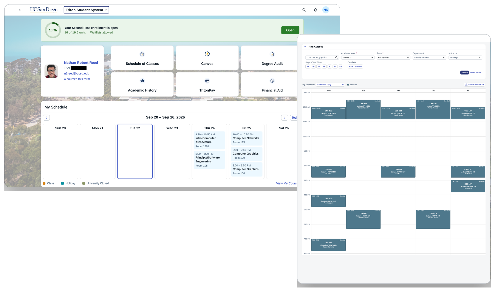

# TSSReg

An unofficial rework of UC San Diego's Triton Student System.

TSS was poised as a replacement for WebReg, but left a lot behind. TSSReg brings the schedule planner back, gives course search some helpful new filters, and gives the homepage a proper structure.

> Not affiliated with, endorsed by, or sponsored by UC San Diego. Works entirely on the client side, does not change any server state.

## Features
- **A course planner**, back from the dead! A unified interface to plan your schedule, find courses that work for you, and see your conflicts before you commit to anything.
- **More filters on the Schedule of Classes**, and reorganization of the existing ones. New filters include time of day and hiding conflicting courses.
- **A Finals tab**, alongside the schedule, showing when and where each of your final exams lands.
- **A reworked student home page**, with proper item organization, a *functional* weekly course calendar, and notifications for events such as enrollment appointment times (with a countdown for the procrastinators!).

## Fixes:
- Multi-day classes showing as if they meet once
- Missing room codes on the detail page and calendar
- Dates rendering wrongly, or throwing outright, on TSS's bad time zone names
- `tss.ucsd.edu` returning "service unavailable" when `/fiori` is missing
- Issues with the day, seat, and credits selectors in the course filters
- An expired session showing a blank or blocked sign-in frame instead of saying what went wrong

## Privacy
Nothing interesting happens. Your course plans are saved locally to your browser, and everything else isn't stored anywhere at all. Nothing is tracked or transmitted. All network requests are to existing TSS endpoints to fetch necessary course information.

## Installation

TBD! Should be on the Chrome and Firefox addon stores soon.